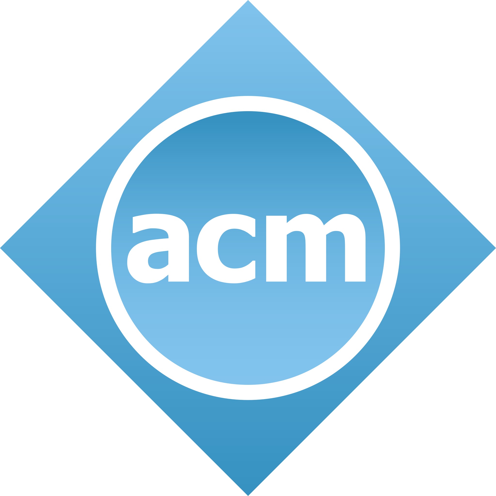
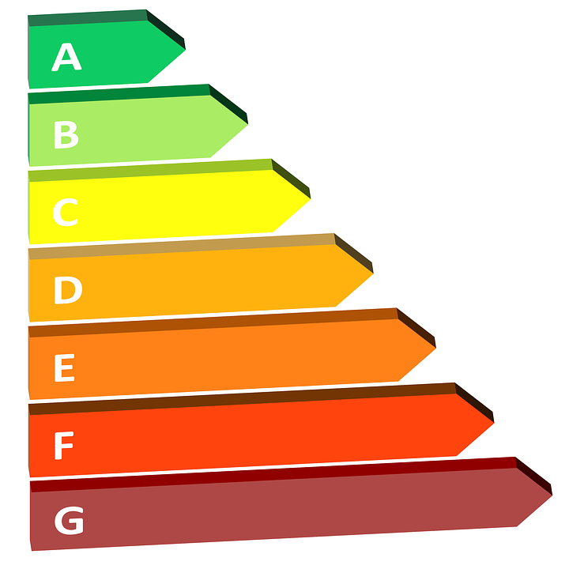

For the past four months, I have been enrolled in the University at Hawai'i at Manoa's ICS 314 course named Software Engineering. This class has a focus on the creation of web applications; however, through the projects and modules that I've studied, I've learned about many different disciplines that I can apply outside of web application development, and in any software engineering or team projects. Here are some of the disciplines that I plan to take away from the software engineering class, and apply to my future endeavors in software development.

##Ethics
Looking at the field of software engineering, you might wonder how ethics has importance in the field. I believe in any professional environment, ethics play a big part in any of the decisions that should be made. Ethics is known as the concern for humans. In my time taking my leadership honors course at Leeward Community College, I have learned that if we want to make a positive impact with what we do, we need to follow a code of ethics as closely as possible. In software engineering, we were introduced to the [ACM Code of Ethics](https://www.acm.org/code-of-ethics), which I believe has great principles to follow. Following this code of ethics will allow us to develop software that won't harm anyone, won't disrespect privacy, and pave the way toward leading a positive impact using software development.

##Coding Standards
Coding standards are the constraints that we follow in order to type readable, efficient code. In this semester, we learned about ESLint, which is a code analysis tool that gives errors when coding standards are violated. These coding standards vastly increase readability and efficiency of our code, as I've experienced in making [music match](https://music-match.github.io/) with my developer team. In the future, I will most definitely be working with a team for my career projects, so I intend to follow some sort of coding standard, and like how we did in ICS 314, use a code analysis tool to enforce this. This way, we can ensure that our code will be efficient, and we won't have as much ambiguity when reading edits and code made by other developers on our team.

##Agile Project Management
Agile project management is the creation and management of a project using multiple iterations of the project. In this sense, the project has an agile life cycles. One agile project management model that we followed in ICS 314 was the issue driven project management model, where we find issues in our product and have them posted on a project board to be fixed. This reminds me of how in robotics we would use a similar scrum system. When leading a development team in the future, I plan to use this agile project management system, so that we can consistently improve the software and product that we provide.

##Conclusion
Despite my goals being completely different from web application design, these disciplines taught in ICS 314 will ultimately be used throughout the entirety of my career, since I will often need to lead a team, or develop software. In order for me to be successful as a software developer, I plan to follow these disciplines, by following a code of ethics, enforcing coding standards and quality, and implementing some sort of agile project management.