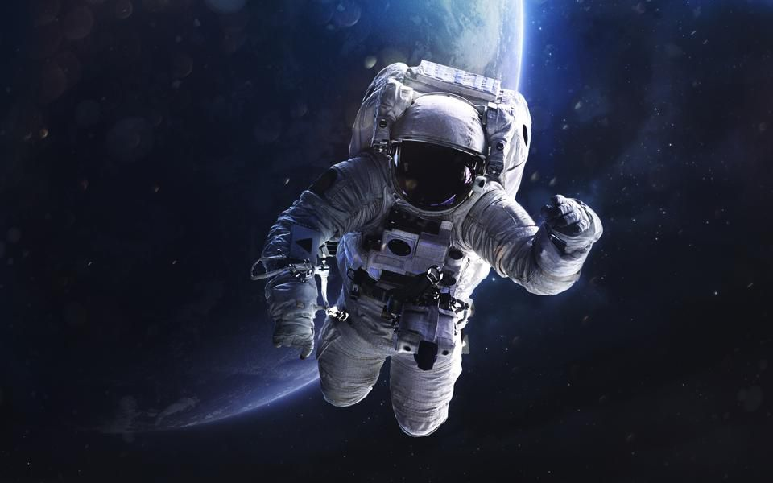
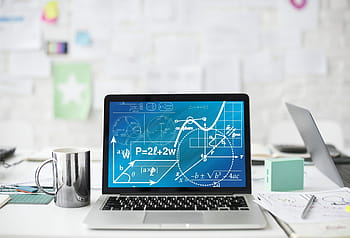
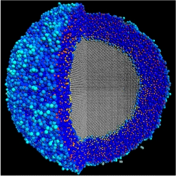

## Childhood Dreams 
My dream when I was a young child in elementary school was to become an astronaut, as I always thought of space as a very interesting and mysterious place that I would have loved to explore. Learning and making discoveries were always some of the most enjoyable parts of my life, whether that be through education or in any other endeavors. Although being an astronaut isn't my dream in the present, this dream was a big influence on what my current dream is.

## Conflicting Aspirations
Throughout my time in High School, I learned a lot of Python, Java, and C++. Computer science was a passion of mine, and still continues to be something that I wish to pursue. One issue that has always bothered me about computer science was the lack of utilization of my math skills. My father always told me to learn math, and I wanted to utilize those skills in what I plan to pursue as a career. Looking back at what I wanted to be as a child, I found a combination of two of my favorite subjects, physics and computer science - computational physics. 

## Future Goals
In my journey to become a computational physicist, my interest is learning how I can use computer science and software engineering to apply it to the world of physics, and how I can use it to make future discoveries about the world. In my future on this journey, I hope to learn how to work with other software engineers, so I am able to lead them in the future. I hope to learn of more ways I can apply my math skills in cI want to learn more about visualization techniques as well as numerical analysis with programming, and lastly the most efficient ways to create algorithms so that I will be fit to create programs in as a computational physicist, or even software engineer. 

