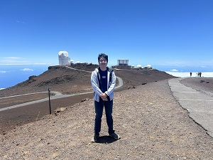
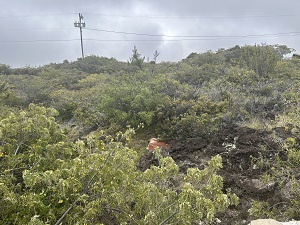
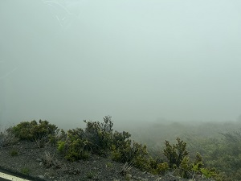
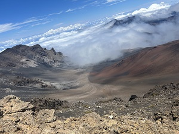

## The Journey to Maui

There I am, born and raised in Oahu, hitting my sixth month in Maui. Behind me is the [Haleakala High Altitude Observatory](https://about.ifa.hawaii.edu/facility/haleakala-observatories/) with the [Daniel K. Inouye Solar Telescope](https://nso.edu/telescopes/dki-solar-telescope/) on the left and the [Maui Space Surveillance Complex](https://spp.fas.org/military/program/track/amos.htm) to my right - both of which crucial in the research of space related endeavors - including my current profession! The path my life has taken on my way to this point had many problems, mainly financial and mental, but I can proudly say that my dream and inspirations are currently being fulfilled.

### Pre-College Circumstances
The image above representes the start of my academic or professional journey, at the bottom of the mountain looking up to the top. My beginnings started in Oahu, with the opportunity to attend primary education. In grade school, I had the dream of becoming an astronaut, as I wanted to explore the unknown, and make an impact through new discoveries, which I would find is not only an astronaut's job, but a researcher's. Pursuing this would prove difficult, as I had lost my motivation to do work in school. Often times I had thought I was not smart enough to make it, that is, until my Junior year of high school. Many of my teachers, despite my constant laziness, continued to believe in me, especially my A+ certification teacher. Deciding that I would no longer waste my teacher's time, I joined SkillsUSA and Robotics, got my act together, and strived to learn and innovate. This would be a great mental start moving forward into college, however, my financial situation would still pose as a speed bump to my journey.

### Road to Bachelor's
My road to obtaining my bachelor's degree is much like being in the fog, as transitioning from high school to college would prove to be difficult. My dream colleges weren't an option due to my less than stellar performance early in high school preventing me from getting scholarships, and my parents didn't have the funds to pay for out of state colleges. Holding onto my dream to make an impact through computer science, I settled with going to Leeward Community College (LCC) and transferring to the University of Hawaii (UH) at Manoa later in my academic career. To pay off tuition, I had worked two jobs as a tutor of different disciplines, which eventually led to my research assistant job when transferring to UH Manoa. My mission of making an impact would finally start being fulfilled as during my time at UH, I was able to contribute to and publish a [research paper on GMOs](https://scholarspace.manoa.hawaii.edu/server/api/core/bitstreams/ce8778c1-c827-4317-9cfb-796bac145704/content) and lead my own [research project on autonomous vehicle pathing](https://manoa.hawaii.edu/undergrad/showcase/wp-content/uploads/2023/05/23S-US-Program-2023.05.05.pdf) (page 54).

### From Oahu to Maui
From the top, there's a beautiful view of Halekala's crater, representing my most recent part of my journey. After I had graduated from UH Manoa, I recieved a job offer at the Maui High Performance Computing Center (MHPCC) and would move from Oahu to live away from my parents. To this day I am still contributing to research using my skills in data and computer science. A lot of people ask how I was able to get through college with all my financial issues, and my honest answer is always inspiration, and motivation. Everyone's motivations are different, for me, it was a desire to make an impact and conduct research. Looking to the future: while I enjoy my time and my contributions to the research at MHPCC, in the future I plan to commit myself more towards sustainability and climate change related research projects, whether that be with MHPCC, as side projects, or wherever my life takes me.
