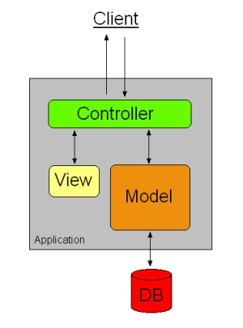

## Design Patterns
Design patterns are reusable solutions to problems that commonly occur in different disciplines. The first question that popped into my mind when I heard about design patterns was "why?". Why study these design patterns, when we can find our own solutions to these problems, since problems in design are often very broad, and often can't apply to a single pattern; however, after learning a bit more and thinking about these patterns, I realized that design patterns are used everywhere. I also have used design patterns, without even knowing it.

## A Look to the Past
In the past, I have extensively used design patterns, and not only in my software engineering projects, but also in robotics. In robotics, in every competition, we would brainstorm ideas for different mechanisms that would solve the hurdles we would have to overcome for the competition. These mechanisms that we brainstormed, at least the most successful ones, were often modeled after previous inventions. That way, we were using design patterns to solve our own problems in an efficient manner.

Just like in robotics, I've also been using design patterns in my software engineering projects. Whenever I followed an example that I've looked up, or used previously created data types to solve a certain program's problem, I've been using design patterns. While there are many small examples, the biggest example of my use of design patterns so far would be how I used one of the standard object oriented design patterns (Model View Controller) in my ["final project for ICS 314"](https://github.com/music-match/music-match). We made a website, where people could share their jams, and one of the pages I had to implement was the edit jams page, where the user can edit a jam that they have previously shared. In this page, we used the jam entry as the model to autofill each table, react for the views to display the model, and meteor for the controller to submit changes.

## Should we Study Design Patterns?
This brings us back to the question I posed at the beginning of this essay: why should we study these design patterns? The answer to this lies in the ways that I've used these design patterns in the past. Previously, I thought design patterns would be used simply as a solution; however, instead of having them as our solutions, we should model our solutions after these design patterns rather than straight up copy them. In this way, we can improve these design patterns in ways that accomodate for the broadness of problems, while still using efficient design patterns. 
