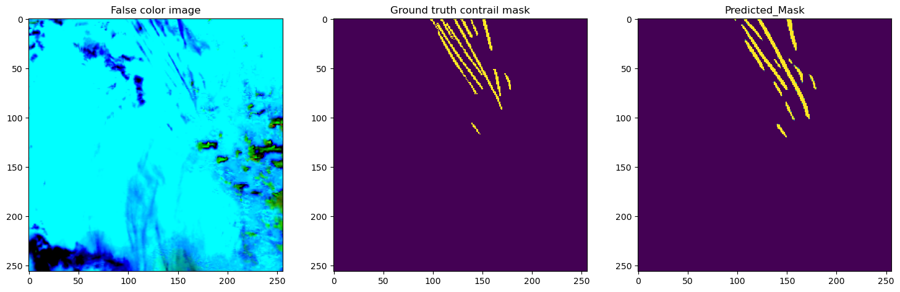

Condensation trails (contrails) are clouds left behind from aircraft engine exhausts. These contrails contribute to climate change by trapping heat in the atmosphere, and thus researchers are putting an effort to identify these contrails in the sky as well as how much they will contribute to climate change, and has been validated in research to contribute approximately 1% of all human caused global warming. In this competition, a machine learning model that takes image frames of the sky at a given situation as input, and outputs a masked version where the contrails are segmented was to be produced. Data includes bands of images that were provided by NASA and NOAA's [GOES-16 Advanced Baseline Imager](https://www.goes-r.gov/spacesegment/abi.html) as described in the [Kaggle competition](https://www.kaggle.com/competitions/google-research-identify-contrails-reduce-global-warming/data).

Doing this project has given me extensive experience in image segmentation and computer vision. This project only used the final image in the frames, so the model would be inputted an image and output an image. Previously I have done image classification projects, however, image segmentation is new to me. Some methods and frameworks that were used in this project were image normalization and cropping to use the neural networks, and pretrained models such as [UNet](https://github.com/milesial/Pytorch-UNet) and [UNet++](https://github.com/4uiiurz1/pytorch-nested-unet).

Our models were evaluated using the dice coefficient on a test set of images consisting of two records. The [public leaderboard](https://www.kaggle.com/competitions/google-research-identify-contrails-reduce-global-warming/leaderboard?tab=public) uses 15% of the test data, and the [private leaderboard](https://www.kaggle.com/competitions/google-research-identify-contrails-reduce-global-warming/leaderboard?) uses 85% of the data. The training for models took more than 4 hours long per run, so on the [public leaderboard](https://www.kaggle.com/competitions/google-research-identify-contrails-reduce-global-warming/leaderboard?tab=public) I earned a dice coefficient of 0.62283 and placed 682/954, and on the [private leaderboard](https://www.kaggle.com/competitions/google-research-identify-contrails-reduce-global-warming/leaderboard?) I earned a dice coefficient of 0.62833 and placed 663/954. To improve my model, different types of pretrained models could be used, as well as more hyperparameter optimization such as learning rates.
