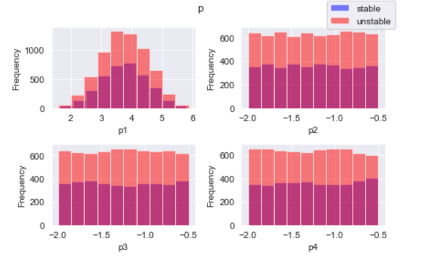
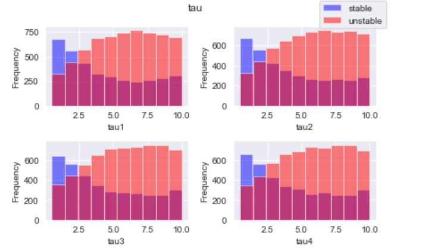
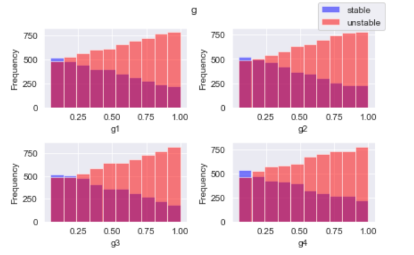
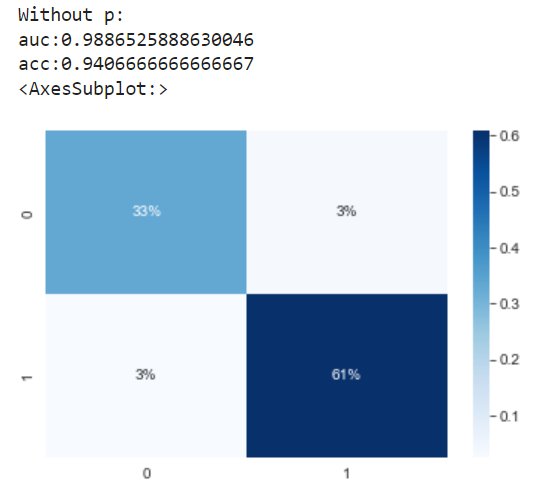

  
  
  
  

Machine learning models are created to estimate trends created by data. One type of problem that machine learning models can be applied to is classification, where you try to predict from a certain group of options. Many different models are possible to be used in these classification problems, such as logistic regression, random forests, xgboost, and neural networks. In this project, I optimized the hyperparameters for each of these machine learning models and compared their AUC score as well as their accuracies and confusion matrices.

[Sklearn](https://scikit-learn.org/stable/) was used to create the logistic regression and random forest models, and the [GridSearchCV](https://scikit-learn.org/stable/modules/generated/sklearn.model_selection.GridSearchCV.html) module was used to optimize hyperparameters for each model except neural network. [Xgboost](https://xgboost.readthedocs.io/en/stable/python/python_api.html) was another model used, and to optimize neural networks hand tuning with a manual grid search was used with [Keras](https://keras.io/) to build the neural network. [Matplotlib](https://matplotlib.org/) was also used for the data analysis earlier in the notebook.

I experienced how to approach normal machine learning problems, given a dataset and the task to predict a certain feature. I learned how to use data visualization to see trends between data, as well as plotting the distributions of any certain feature. I also experimented with automating the hyperparameter optimization for keras neural networks; however, the runtime was too long so I ended up hand tuning it. More models could be tested with this dataset, I only tested logistic regression as a baseline, as well as random forest, xgboost, and neural network since they were mentioned in the [paper associated with this dataset](https://www.semanticscholar.org/paper/Towards-Concise-Models-of-Grid-Stability-Arzamasov-B%C3%B6hm/de8529431f19f1bb5008b2f26d4315e607b60d5a).
