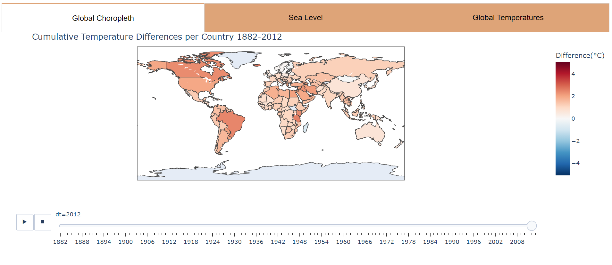
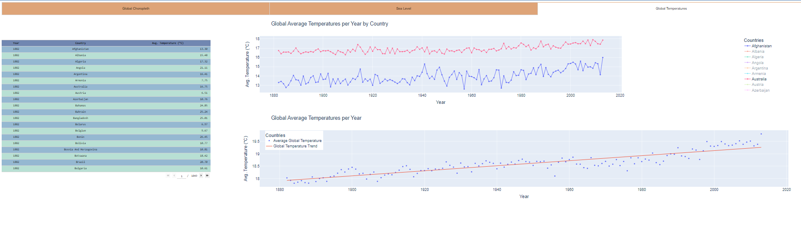
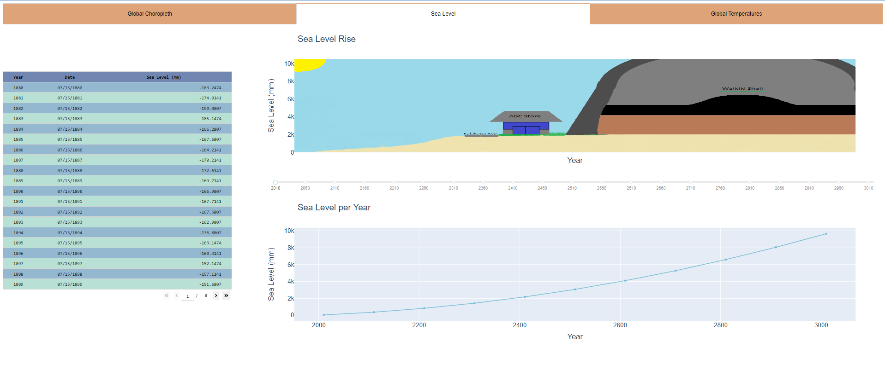

  
  
  

The purpose of this project was to find a way to effectively visualize how global warming will affect different parts of the world, with a emphasis on how Hawaii would be affected, since Hawaii is projected to be one of the most affected areas from global warming. There are three focuses for the project: (1) how global warming has affected individual states around the world, and (2) how global warming is projected to affect states in the future. Data used in this project includes monthly temperatures by country from 1743-2013 for 243 countries as described in this [Kaggle page](https://www.kaggle.com/datasets/berkeleyearth/climate-change-earth-surface-temperature-data ). We used sea level rise data from 1993-2003 from this [Kaggle dataset](https://www.kaggle.com/datasets/jarredpriester/global-sea-level-rise).

To visualize the impact of global warming, we used three different visualizations: (1) a map of how much temperature has changed over time, (2) graphs of temperature values over time for each country, and (3) a visualization showing how projected sea level rise would affect Hawaii. Our group visualized each of these using [dash and plotly](https://plotly.com/dash/), and my task was specifically to visualize the map of temperatures changing for each country over time. The most challenging part of this project was getting the differences between each year, since it required data engineering that I hadn't done before, as well as figuring out how to color the map to accurately convey the story of the data.

Our project was presented in front of our ICS 484 class, and received feedback for how the project could be improved. Some improvements that can be done in the future is to add in more data, show correlations between global warming and sea level rise, and we could show how sea level rise would affect more places other than just Hawaii in the future, like places in Polynesia such as Kiribati.
