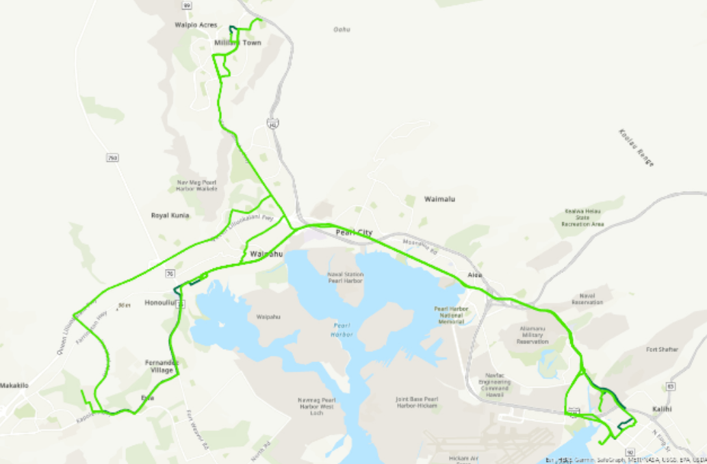
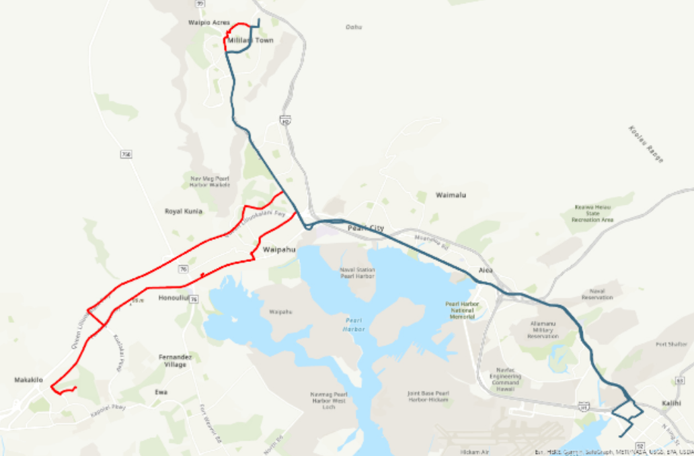

  
  

Autonomous Vehicles (AVs) are vehicles that can complete tasks without a predetermined path, and can complete said tasks without alterations from humans. In this study, we explored the impact that these AVs would have on household travel-activity patterns in the Oahu Metropolitan Planning Organization study area as a rideshare service. Different scenarios would be surveyed, such as how [Honolulu Authority for Rapid Transportation's (HART)](https://honolulutransit.org/) rail being built in Hawaii would affect these AVs. To do this, we implemented heuristics that solved the household activity pattern problem (HAPP) and ran it on real data provided by HART, then compared the heuristic results to the actual path taken by survey participants using hypothesis testing. We also used regression analysis to find which features of the provided data contributes most to the final paths.

My contributions to this project include most of the coding and data science applications. I started on this project by coding the simulations using heuristics described in Marius M. Solomon's [paper on heuristics solving vehicle routing problems (VRPs)](https://www.jstor.org/stable/170697). I coded all three of the insertion type heuristics, tested them on different scenarios involving the rail, compared them to actual paths along with another heuristic coded by another research partner, and conducted the regression analysis. This project had me gain experience in complex algorithms with the heuristics, hypothesis testing to compare the heuristics, and regression analysis with p-values to find feature importance.

This project ended up being accepted to the [UH Manoa's Undergraduate Research Opportunities Program (UROP)](https://manoa.hawaii.edu/undergrad/urop/) and is under review for HART.
