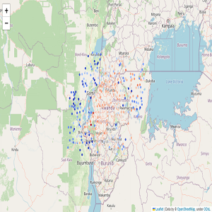

Carbon dioxide (CO2) is a prominent greenhouse gas and can be an indicator for climate change, so accurately monitoring these CO2 is important in the process for fighting against climate change. Europe and North America both have systems that allow them to monitor CO2 emissions, however, Africa has far less of these systems. The task of making a machine learning model that forecasts CO2 emissions in Africa will allow for CO2 monitoring where not possible previously due to these monitoring systems being difficult to implement. This project's task is to create a machine learning model that takes sulphur dioxide, carbon monoxide, nitrogen dioxide, formaldehyde, ultraviolet (UV) aerosol index, ozone, and cloud features as input, and outputs a forecasted CO2 amount for a given location and time. Data was provided by [Sentinel-5P](https://sentinels.copernicus.eu/web/sentinel/missions/sentinel-5p) as described in the [Kaggle competition](https://www.kaggle.com/competitions/playground-series-s3e20/overview) for this project.

In this project, I gained experience in working with time series data, as previously I have not worked extensively with it. During the process of improving my model, I experimented with data engineering methods that I have not previously done before, such as rolling mean, rotating data over an axis, making ensemble models using different features, and KMeans clustering geographical locations together. Different frameworks that I used include [Sklearn](https://scikit-learn.org/stable/) for linear models, data splits, clustering, and preprocessing, [XGBoost](https://xgboost.readthedocs.io/en/stable/python/python_api.html) for ensemble tree models, and [Keras](https://keras.io/) for neural network models.

Results of models would be evaluated on a test set for a [public leaderboard](https://www.kaggle.com/competitions/playground-series-s3e20/leaderboard?tab=public) and approximately 59% of the test set would be used for a [private leaderboard](https://www.kaggle.com/competitions/playground-series-s3e20/leaderboard?). On the [public leaderboard](https://www.kaggle.com/competitions/playground-series-s3e20/leaderboard?tab=public) I earned a RMSE score of 21.07137 and placed 169/1442, and on the [private leaderboard](https://www.kaggle.com/competitions/playground-series-s3e20/leaderboard?) I earned a RMSE score of 13.42658 and placed 241/1442. To improve my models more experimentation can be done with the neural network model, since I only made a simple neural network, and principal component analysis has also been shown to be successful when applied to the data.
