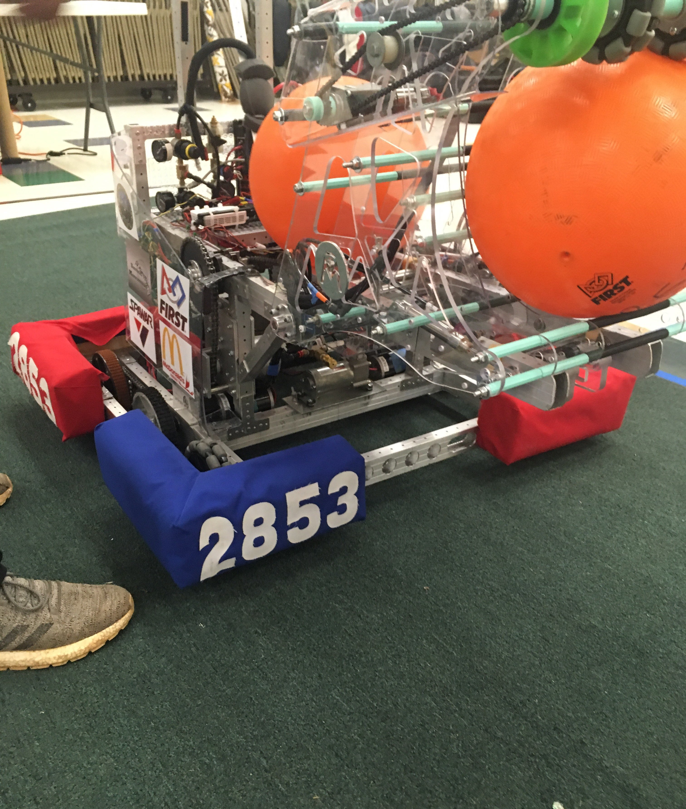
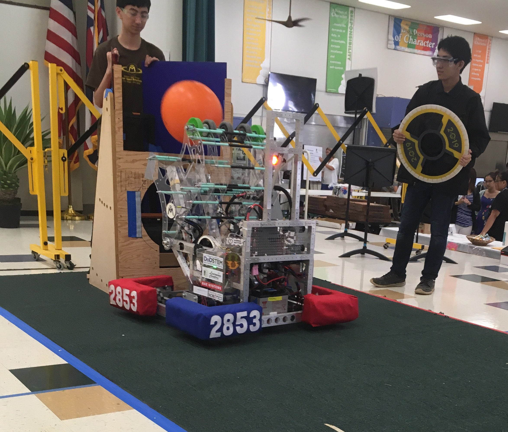
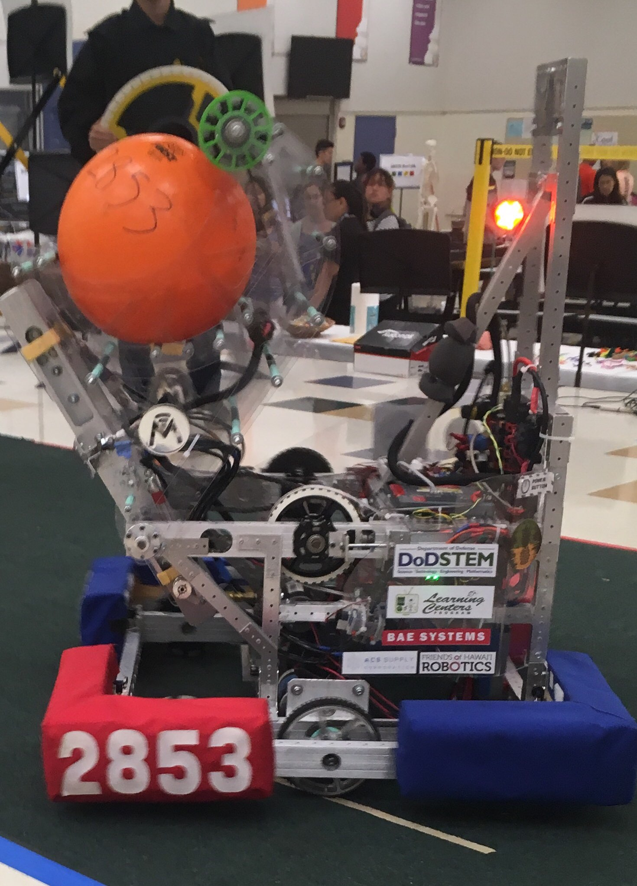
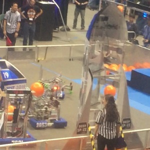

  
  
  
  

FIRST Robotics is a nonprofit organization that promotes STEM education opportunities and learning to the youth by providing different competitions for all different levels of students from Kindergarten to 12th grade. These competitions have different objectives and rules each year. The highest competition is the FIRST Robotics Competion. In my senior year, our game plan required us to have a robot that used camera vision, and used that camera vision to automatically align to shoot a hatch onto a hole and shoot a ball into the hole above the hatch. A short [animation](https://www.youtube.com/watch?v=Mew6G_og-PI) was made by FIRST robotics to explain the exact rules and ways to score in the game, along with a [manual](https://firstfrc.blob.core.windows.net/frc2019/Manual/HTML/2019FRCGameSeasonManual.htm#_Toc5713726) that we studied to come up with our game plan.

For this project, I was the one of the only people on the team who would be responsible of the programming of the robot, in that sense I was utilizing leadership skills by serving the team as much as I could by programming the robot. I started by programming the controls for the robot, from the movement of the motors controlling the wheels corresponding to the joysticks on the controllers, to the extention of the pistons that launched a hatch when a button is pressed. Using these functions of controls, I programmed an algorithm that allowed an auto alignment mode so that the robot can autonomously align itself to reflective tape using a camera so that our drivers wouldn't need to spend time aligning to shoot the hatch and the ball when the competition came around.

In this project, I learned much about how to use C++ since prior to this I had not used C++, gained experience in working with other programmers since I would be working closely with mentors and other teammates, and lastly about teamwork and communication as I would often have to communicate my progress in order to continue building and developing our robot. 

Source: [mililanirobotics/FRC2019](https://github.com/mililanirobotics/FRC2019)

