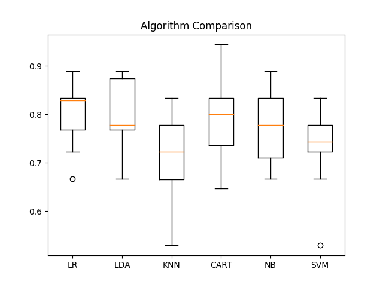

This program is a machine learning model I created to predict whether or not people would survive the titanic disaster or if they would have survived. This project helped me learn about making machine learning models with [Sklearn](https://scikit-learn.org/stable/), given a dataset. The dataset I used was provided by [Kaggle](https://www.kaggle.com/). I also learned about data analysis, as I would need to analyze the data to improve my predictions.

My process through this project was to first look at each of the features, and find trends between the features and survival rate. Any features that had trends I would include in my machine learning model. The second step was to find which machine learning model I would use. To do this, I would make a box and whisker plot based on each of the machine learning models with 20% of the training dataset. After I make a judgement on which model works the best with the features, I would use the model and export my predictions to a csv. 

With my machine learning model, I was able to make a submission to the Kaggle competition with 77.511% accuracy of whether or not the crewmates would survive. I can improve on this project by researching more into which features have the best correlations with survival rate, and research what is actually being done in each model, so I can further analyze into which model works best.
 
Source: <a href="https://github.com/PrestonTGarcia/Titanic"><i class="large github icon"></i>PrestonTGarcia/Titanic</a>
