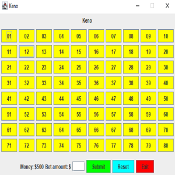

I initially created this program in ICS 211 in my second semester of college as a project that will allow me to learn GUI creation using [JFrame](https://docs.oracle.com/javase/7/docs/api/javax/swing/JFrame.html) and [ArrayLists](https://docs.oracle.com/javase/8/docs/api/java/util/ArrayList.html) in Java. I revisited this project since I did not use github back then, and my laptop broke down, so I did not have access to this project again. Originally, when doing this project, my algorithms were very inefficient, since I did not use the ArrayLists to their full potential, as I have realized in my revisiting of this project.

In revisiting this project, I was able to refresh my knowledge in making GUIs in Java with JFrame as well as ArrayList methods. I can improve on this project by making it more modular, by packing the functionalities into methods rather than having raw code out. I could also improve this project by implementing some of the lists as hash tables instead, since the .contains method runs in linear time (O(n)) according to the ArrayList documentation; however, a hash table's .contains method runs in O(1) expected, so finding a way to implement this with hashtables will make the program more efficient.

Source: <a href="https://github.com/PrestonTGarcia/Keno"><i class="large github icon "></i>PrestonTGarcia/Keno</a>
