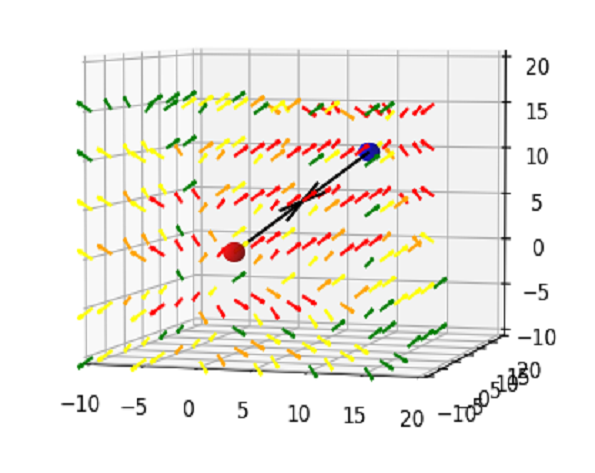
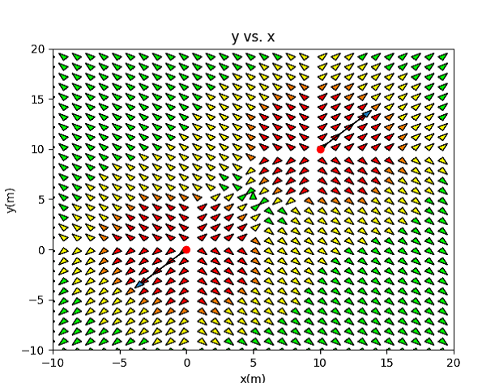

	

  		
  		
	

This program can take the position of two charged particles and their respective charges, and show the resulting electric field of the two particles, with colors representing the strength of the field, and arrows representing the direction of the electric force at a certain point on the graph.

This visualization is implemented with the Python libraries [Tkinter](https://docs.python.org/3/library/tkinter.html) for the main window, [Matplotlib](https://matplotlib.org/) for the visualization, and [Numpy](https://numpy.org/) to process the large dataset created by the two particles. In the 3D version, I also used [Matplotlib3D](https://matplotlib.org/2.0.2/mpl_toolkits/mplot3d/tutorial.html). 

This project helped me think more of how I can visualize each of the different parts of things, such as changing the color based on what the average of the data is, or making the arrows smaller to see where they are going. I also learned a lot about using Numpy to process large datasets.

In the future, I plan to improve on this program by adding the option to plot more than two particles, and have the computations of the program be lesser, since the program calculates the force at each point; however, there should be a faster way to do this using a little bit of calculus.

Source: <a href="https://github.com/PrestonTGarcia/RandomWalk"><i class="large github icon "></i>PrestonTGarcia/Electric-Field</a>

