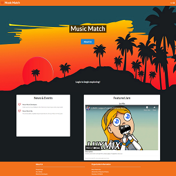

In this website, we were tasked to create a website that allows UH musicians to network with each other, share eachother's jams, and comment on each other's jams. I worked on this project with other ICS 314 classmates, and named the website [Music Match](https://music-match.github.io/). We used an issue driven project management system to designate our tasks, where we would find issues in our project and add them as issues on our next milestone for the website. 

I contributed to the behavior of many of the site's pages, such as the create jams, searchbars, redirects to other pages, and tests, as well as helped manage the issues on Github. We used [Meteor](https://www.meteor.com/) with [React](https://reactjs.org/) and [Semantic UI](https://semantic-ui.com/) to create this website.

Through the process of creating this website, I experienced what it was like to work on a programming project with a group, and how to use issue driven project management with Github. I also learned of how hosting sites and programs work through Digital Ocean.

Source: <a href="https://github.com/music-match/music-match"><i class="large github icon"></i>music-match/music-match</a>
